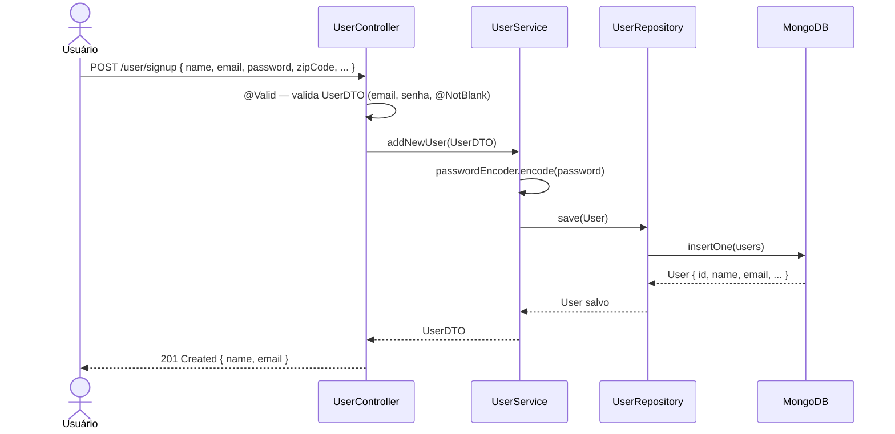
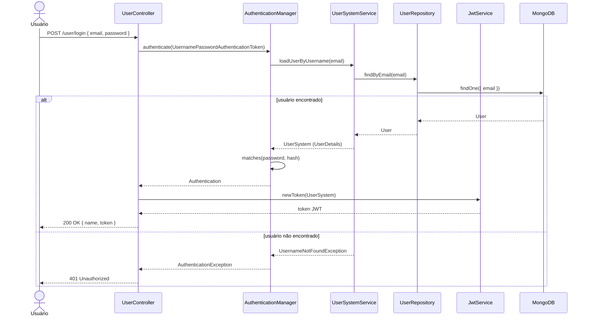
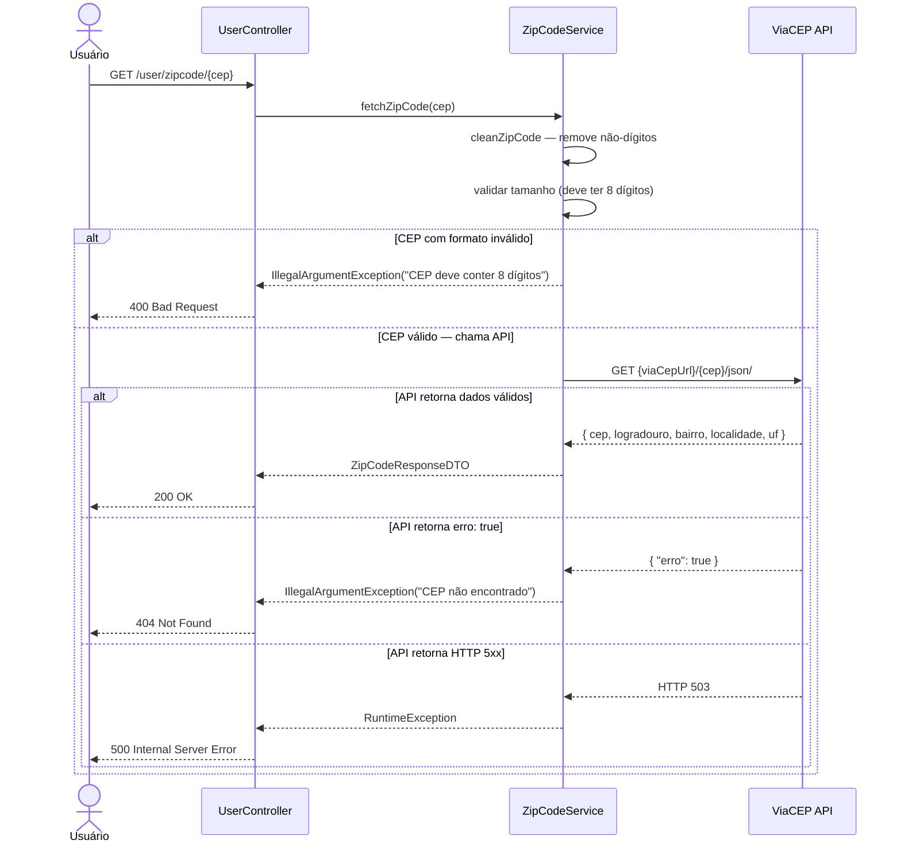
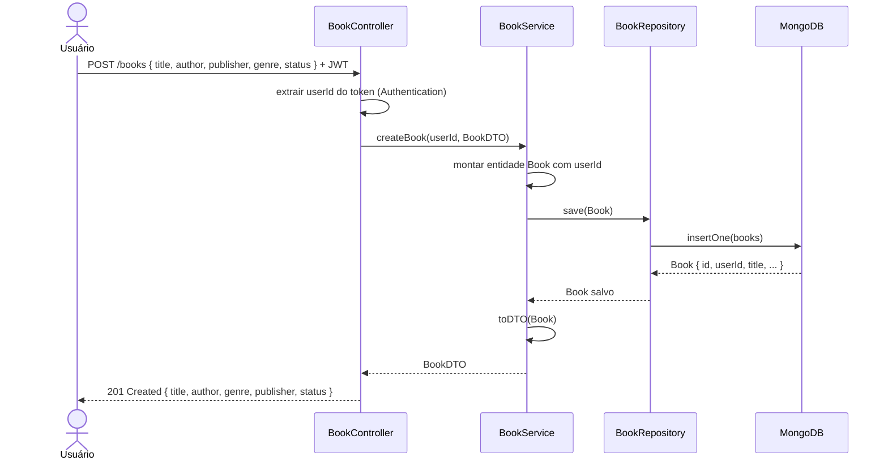
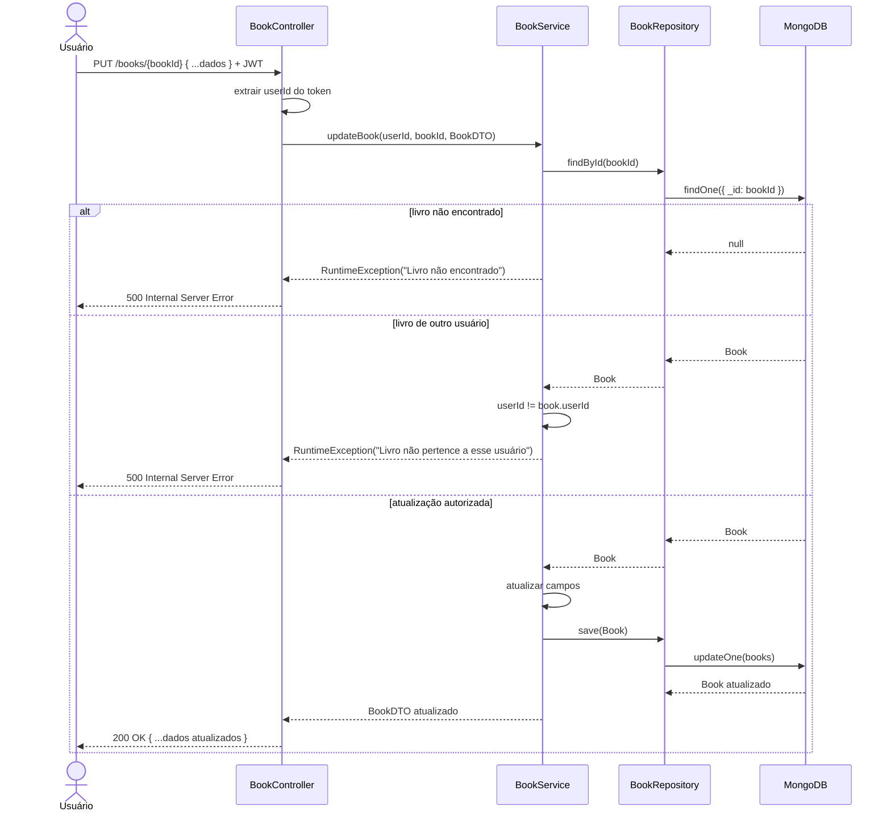
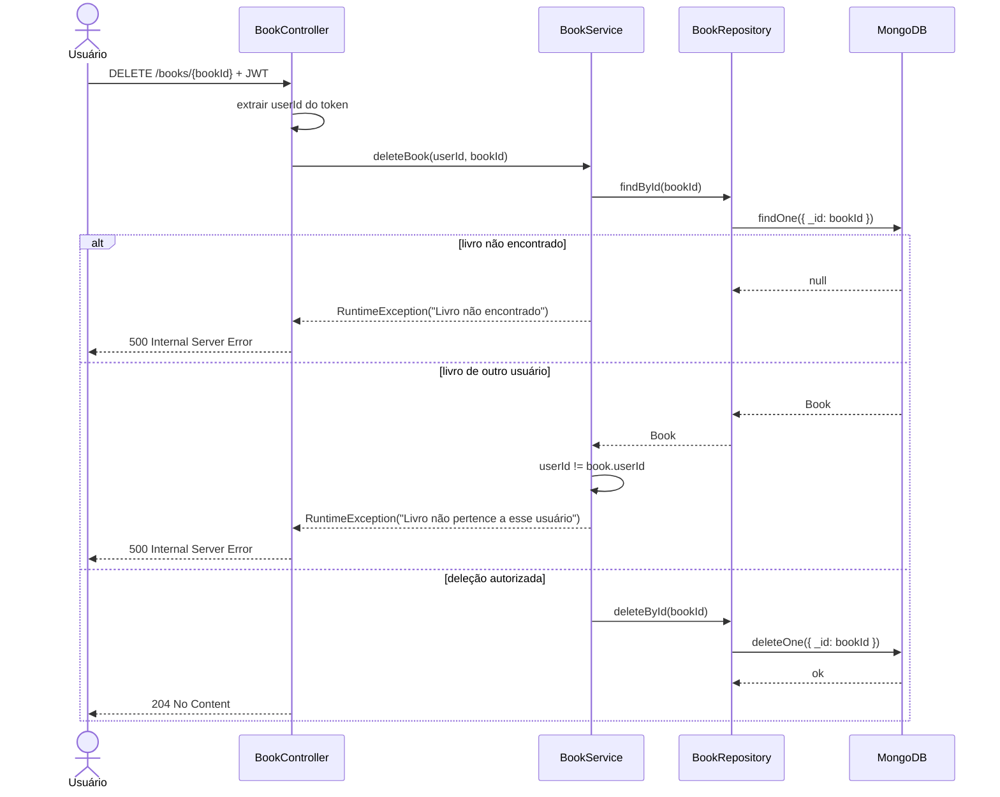
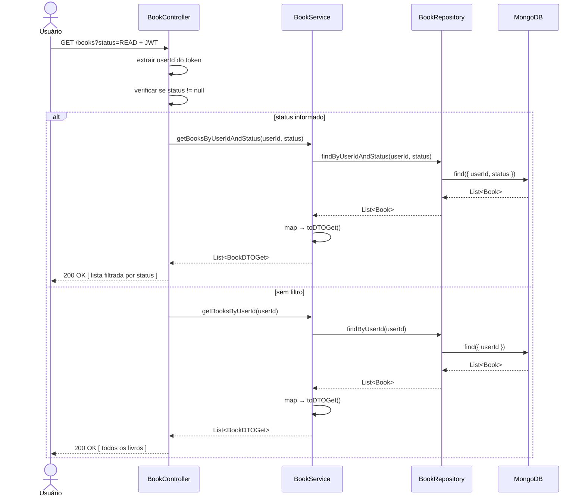

# RTM — Matriz de Rastreabilidade de Requisitos
> **MyLibrary** · Qualidade de Software · 2025/1

A Matriz de Rastreabilidade de Requisitos (RTM) mapeia cada requisito funcional aos seus respectivos testes, garantindo 100% de cobertura. Cada requisito é acompanhado de um Diagrama UML de Sequência detalhando o fluxo da operação.

---

## Índice

- [RF01 — Cadastro e Login de Usuários](#rf01--cadastro-e-login-de-usuários)
- [RF02 — Gerenciamento de Livros](#rf02--gerenciamento-de-livros)
- [RF03 — Filtragem por Status](#rf03--filtragem-por-status)
- [Resumo da Cobertura](#resumo-da-cobertura)

---

## RF01 — Cadastro e Login de Usuários

> O sistema deve permitir o cadastro e login de usuários, incluindo validação de dados de entrada e consulta automática de endereço por CEP.

### Diagrama UML de Sequência — Cadastro de Usuário

### Diagrama UML de Sequência — Login de Usuário

### Diagrama UML de Sequência — Consulta de CEP (VCR)

### Matriz RF01

| ID | Teste | Classe | Tipo | Camada | Cobre |
|---|---|---|---|---|---|
| RF01-T01 | `shouldSaveAndRetrieveUserByEmail` | `RepositoryTest` | Unitário | Repositório | Persistência do usuário no MongoDB |
| RF01-T02 | `shouldReturnEmptyResultForNonExistentEmail` | `RepositoryTest` | Unitário | Repositório | Email inexistente retorna Optional vazio |
| RF01-T03 | `shouldPersistAutomaticallyGeneratedId` | `RepositoryTest` | Unitário | Repositório | ID gerado automaticamente pelo MongoDB |
| RF01-T04 | `testUserDTO` (parametrizado — 9 cenários) | `DtoTest` | Parametrizado | DTO | Validação de campos do `UserDTO` via `@Valid` |
| RF01-T05 | `testUserLoginDTO` (parametrizado — 5 cenários) | `DtoTest` | Parametrizado | DTO | Validação de campos do `UserLoginDTO` |
| RF01-T06 | `testAddNewUser` (parametrizado — 2 cenários) | `UserServiceTest` | Parametrizado | Serviço | Cadastro de usuário e hash da senha |
| RF01-T07 | `loadUserByUsernameTest` | `UseSystemServiceTest` | Integração | Serviço | Carregamento de `UserDetails` por email |
| RF01-T08 | `loadUserByUsernameNotFoundTest` | `UseSystemServiceTest` | Caixa Branca | Serviço | Lança `UsernameNotFoundException` para email inexistente |
| RF01-T09 | `shouldCreateUser` | `UserControllerE2ETest` | Caixa Preta (E2E) | Controller | POST /user/signup retorna 201 |
| RF01-T10 | `shouldLoginUser` | `UserControllerE2ETest` | Caixa Preta (E2E) | Controller | POST /user/login retorna token JWT e nome |
| RF01-T11 | `shouldLoginUserUnauthorized` | `UserControllerE2ETest` | Caixa Preta (E2E) | Controller | Login com senha errada retorna 401 |
| RF01-T12 | `deveRetornarDadosParaCepValido` | `ZipCodeServiceTest` | VCR | Serviço | Consulta CEP válido — dados corretos retornados |
| RF01-T13 | `deveAceitarCepFormatadoComHifen` | `ZipCodeServiceTest` | VCR | Serviço | CEP com hífen normalizado antes da chamada HTTP |
| RF01-T14 | `deveLancarExcecaoParaCepNaoEncontrado` | `ZipCodeServiceTest` | VCR | Serviço | CEP inexistente lança `IllegalArgumentException` |
| RF01-T15 | `deveLancarExcecaoParaCepComFormatoInvalido` (parametrizado — 4 cenários) | `ZipCodeServiceTest` | Parametrizado / VCR | Serviço | CEP com dígitos insuficientes ou inválidos |
| RF01-T16 | `deveLancarExcecaoQuandoApiRetornaErroHttp` | `ZipCodeServiceTest` | VCR | Serviço | HTTP 503 lança `RuntimeException` |
| RF01-T17 | `deveConfirmarUmaRequisicaoFeita` | `ZipCodeServiceTest` | VCR | Serviço | Exatamente 1 chamada HTTP registrada no MockWebServer |
| RF01-T18 | `chouldReturnZipcode` | `UserControllerE2ETest` | Caixa Preta (E2E) | Controller | GET /user/zipcode retorna 200 com dados |
| RF01-T19 | `chouldReturnZipcodeNotFound` | `UserControllerE2ETest` | Caixa Preta (E2E) | Controller | GET /user/zipcode CEP inválido retorna 404 |

---

## RF02 — Gerenciamento de Livros

> O sistema deve permitir o gerenciamento completo de livros (criar, listar, editar e deletar), garantindo que cada usuário acesse apenas seus próprios livros.

### Diagrama UML de Sequência — Criar Livro

### Diagrama UML de Sequência — Atualizar Livro

### Diagrama UML de Sequência — Deletar Livro

### Matriz RF02

| ID | Teste | Classe | Tipo | Camada | Cobre |
|---|---|---|---|---|---|
| RF02-T01 | `testGetBooksByUserId` | `BookServiceTest` | Integração | Serviço | Listagem de livros por userId |
| RF02-T02 | `testGetBooksByUserId_NotFound` | `BookServiceTest` | Integração | Serviço | Lista vazia para usuário sem livros |
| RF02-T03 | `testCreateBook` | `BookServiceTest` | Integração | Serviço | Criação de livro retorna DTO preenchido |
| RF02-T04 | `testIUpdateBook` | `BookServiceTest` | Integração | Serviço | Atualização de título, autor e status |
| RF02-T05 | `testIUpdateBookInvalidUserId` | `BookServiceTest` | Caixa Branca | Serviço | Proteção de ownership — lança exceção |
| RF02-T06 | `testIUpdateBookInvalidUserIdNotFound` | `BookServiceTest` | Caixa Branca | Serviço | Livro inexistente lança exceção na atualização |
| RF02-T07 | `testDeleteBook` | `BookServiceTest` | Integração | Serviço | Deleção e confirmação via listagem |
| RF02-T08 | `testDeleteBookInvalidIdUser` | `BookServiceTest` | Caixa Branca | Serviço | Proteção de ownership — lança exceção |
| RF02-T09 | `testDeleteNotFoundBook` | `BookServiceTest` | Caixa Branca | Serviço | Livro inexistente lança exceção na deleção |
| RF02-T10 | `shouldReturnBookList` | `BookControllerE2ETest` | Caixa Preta (E2E) | Controller | GET /books retorna 200 com 3 livros |
| RF02-T11 | `shouldCreateBook` | `BookControllerE2ETest` | Caixa Preta (E2E) | Controller | POST /books retorna 201 |
| RF02-T12 | `shouldUpdateBook` | `BookControllerE2ETest` | Caixa Preta (E2E) | Controller | PUT /books/{id} retorna 200 |
| RF02-T13 | `shouldDeleteBook` | `BookControllerE2ETest` | Caixa Preta (E2E) | Controller | DELETE /books/{id} retorna 204 |

---

## RF03 — Filtragem por Status

> O sistema deve permitir a filtragem de livros por status de leitura (`WANNA_READ`, `READING`, `READ`).

### Diagrama UML de Sequência — Listar com Filtro de Status

### Matriz RF03

| ID | Teste | Classe | Tipo | Camada | Cobre |
|---|---|---|---|---|---|
| RF03-T01 | `testGetBooksByUserIdAndStatus` | `BookServiceTest` | Integração | Serviço | Filtro pelos 3 status (`READ`, `READING`, `WANNA_READ`) |
| RF03-T02 | `shouldReturnReadBookList` | `BookControllerE2ETest` | Caixa Preta (E2E) | Controller | GET /books?status=READ retorna somente livros READ |
| RF03-T03 | `shouldReturnReadingBookList` | `BookControllerE2ETest` | Caixa Preta (E2E) | Controller | GET /books?status=READING retorna somente livros READING |
| RF03-T04 | `shouldReturnWannaReadBookList` | `BookControllerE2ETest` | Caixa Preta (E2E) | Controller | GET /books?status=WANNA_READ retorna somente livros WANNA_READ |

---

## Resumo da Cobertura

### Por Requisito

| Requisito | Total de Testes | Tipos Cobertos | Status |
|---|---|---|---|
| RF01 | 19 | Unitário, Integração, Parametrizado, Caixa Branca, VCR, E2E | ✅ 100% |
| RF02 | 13 | Integração, Caixa Branca, E2E | ✅ 100% |
| RF03 | 4 | Integração, E2E | ✅ 100% |
| **Total** | **36** | **Todos os tipos exigidos** | ✅ |

### Por Tipo de Teste

| Tipo | Qtd | Ferramenta | Arquivo(s) |
|---|---|---|---|
| Unitário | 3 | JUnit 5 + Testcontainers | `RepositoryTest` |
| Integração | 8 | JUnit 5 + Testcontainers | `BookServiceTest`, `UserServiceTest`, `UseSystemServiceTest` |
| Parametrizado | 4 | JUnit 5 `@ParameterizedTest` | `DtoTest`, `UserServiceTest`, `ZipCodeServiceTest` |
| Caixa Branca | 5 | JUnit 5 + Testcontainers | `BookServiceTest`, `UseSystemServiceTest` |
| Caixa Preta (E2E) | 10 | MockMvc + Testcontainers | `BookControllerE2ETest`, `UserControllerE2ETest` |
| VCR | 6 | MockWebServer (OkHttp) | `ZipCodeServiceTest` |
| **Total** | **36** | | |

### Arquivos de Teste

| Arquivo | Pacote | Nº de Testes |
|---|---|---|
| `RepositoryTest.java` | `repository` | 3 |
| `DtoTest.java` | `dto` | 2 (14 cenários parametrizados) |
| `UserServiceTest.java` | `service` | 1 (2 cenários parametrizados) |
| `UseSystemServiceTest.java` | `service` | 2 |
| `BookServiceTest.java` | `service` | 9 |
| `BookControllerE2ETest.java` | `controller` | 7 |
| `UserControllerE2ETest.java` | `controller` | 5 |
| `ZipCodeServiceTest.java` | `vcr` | 6 |
| **Total** | | **35** |

### Cobertura de Código

| Métrica | Meta | Ferramenta |
|---|---|---|
| Cobertura de linhas | ≥ 80% | JaCoCo + SonarCloud |
| Cobertura de branches | ≥ 80% | JaCoCo + SonarCloud |
| Quality Gate | Passed | SonarCloud |

> O relatório completo é gerado em `target/site/jacoco/index.html` após `./mvnw clean verify`.
